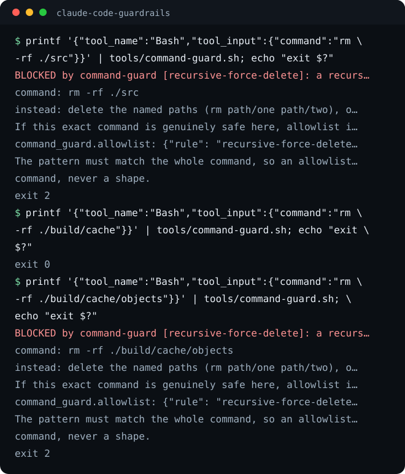

# claude-code-guardrails

Four deterministic hooks for Claude Code that refuse a dangerous command, a protected write, or a colliding session before it runs, and say what to do instead. No model in the loop. The fourth guard is a liveness harness that proves the other three still block, months later.

Works with Claude Code out of the box. Bash and Python 3.9+, nothing else.




## Quick start

```bash
git clone https://github.com/eliferres/claude-code-guardrails.git
cd claude-code-guardrails
tools/liveness.sh          # every installed guard, proved to still block
bash tests/run-tests.sh    # the full suite, hermetic, no network
```

To install: copy `tools/`, `guardrails.json` and `demo/.claude/settings.json`
into your own project root, then edit `guardrails.json`: the rules, the
protected paths and the allowlist are all yours. The walkthrough below runs
every guard against the fictional workspace in `demo/`, no install needed.

## The four guards

**Command guard.** A PreToolUse hook on Bash. It matches the command against a
list of shapes you configure (recursive force-delete, blanket `git add -A`,
world-writable or recursive `chmod`, force-push to a protected branch,
curl-piped-into-a-shell, `git reset --hard`, `git clean -f`) and refuses with
the shape it caught and the safe way to do the same job. One exact command can
be allowlisted; a shape cannot.

**Protected-file lock.** A PreToolUse hook on writes. Files you list as
high-stakes (settings, hook scripts, the rules the agent reads every session)
are refused unless an approval token names them. The token covers one batch,
expires, and is minted by a separate command a human runs after seeing the
change. A live token from other work is not a yes for this one.

**Cross-session write claims.** Two agent sessions on one file means the second
write silently eats the first. The first writer claims the file; a second
session is refused, told who holds it and for how long, and given two ways out:
release the claim, or take it over. A takeover is logged, and what the displaced
session was holding is written to a ledger so it gets picked up rather than lost.

**Gate liveness.** Guards rot quietly: a refactor loosens a pattern, a test
starts passing for the wrong reason, and the wall has been open for a month. The
manifest lists every installed guard, every guard needs at least one red case
proving it still blocks, and the harness fails if an entry has no red case, if a
red case stops blocking, or if a red case still passes with the guard stubbed
out. That last check is the point: a test that passes without the guard was
never testing the guard.

## The wiring, verbatim

This is the whole install, copied from `demo/.claude/settings.json` (that file
is the source of truth):

```json
{
  "hooks": {
    "PreToolUse": [
      {
        "matcher": "Bash",
        "hooks": [
          { "type": "command", "command": "\"$CLAUDE_PROJECT_DIR\"/tools/command-guard.sh", "timeout": 10 }
        ]
      },
      {
        "matcher": "Write|Edit|NotebookEdit",
        "hooks": [
          { "type": "command", "command": "\"$CLAUDE_PROJECT_DIR\"/tools/file-lock-guard.sh", "timeout": 10 },
          { "type": "command", "command": "\"$CLAUDE_PROJECT_DIR\"/tools/claims-guard.sh", "timeout": 10 }
        ]
      }
    ],
    "SessionEnd": [
      {
        "hooks": [
          { "type": "command", "command": "\"$CLAUDE_PROJECT_DIR\"/tools/claims-clear.sh", "timeout": 10 }
        ]
      }
    ]
  }
}
```

Guards deny by exiting 2 with the reason on stderr: the PreToolUse contract
that cancels the tool call and hands the text back to the agent. Everything they
do not block exits 0 and is never seen again.

## Walkthrough

Every command below runs from a fresh clone, against the demo workspace.

```bash
export GUARDRAILS_PROJECT_DIR="$PWD/demo"
```

**Try a blocked command.**

```bash
printf '{"tool_name":"Bash","tool_input":{"command":"rm -rf ./src"}}' | tools/command-guard.sh
echo "exit $?"
```

```
BLOCKED by command-guard [recursive-force-delete]: a recursive force-delete (rm -rf), which removes a tree with no confirmation and no undo
  command: rm -rf ./src
  instead: delete the named paths (rm path/one path/two), or move them to a trash directory you can inspect
  If this exact command is genuinely safe here, allowlist it in .../demo/guardrails.json under
  command_guard.allowlist: {"rule": "recursive-force-delete", "command": "^...$", "why": "..."}.
  The pattern must match the whole command, so an allowlist entry frees one
  command, never a shape.
exit 2
```

The config path in a real refusal is absolute; it is shortened here.

The demo config allowlists exactly one command (the generated build cache),
and the neighbour path is still refused, because an allowlist entry is a whole
anchored command, not a pattern:

```bash
printf '{"tool_name":"Bash","tool_input":{"command":"rm -rf ./build/cache"}}' | tools/command-guard.sh
echo "exit $?"   # 0
printf '{"tool_name":"Bash","tool_input":{"command":"rm -rf ./build/cache/objects"}}' | tools/command-guard.sh
echo "exit $?"   # 2
```

**Write to a protected file, get refused, mint a token, succeed.**

```bash
printf '{"tool_name":"Write","tool_input":{"file_path":"%s/rules/team-rules.md"}}' "$GUARDRAILS_PROJECT_DIR" \
  | tools/file-lock-guard.sh
echo "exit $?"   # 2 — no token, and the refusal prints the exact mint command

tools/lock-approve.sh "tighten the review rule" "$GUARDRAILS_PROJECT_DIR/rules/team-rules.md"

printf '{"tool_name":"Write","tool_input":{"file_path":"%s/rules/team-rules.md"}}' "$GUARDRAILS_PROJECT_DIR" \
  | tools/file-lock-guard.sh
echo "exit $?"   # 0 — the token names this file

printf '{"tool_name":"Write","tool_input":{"file_path":"%s/guardrails.json"}}' "$GUARDRAILS_PROJECT_DIR" \
  | tools/file-lock-guard.sh
echo "exit $?"   # 2 — the same live token does not cover a file outside its batch
```

**Collide two sessions on one file.**

```bash
printf '{"tool_name":"Write","tool_input":{"file_path":"%s/notes/scratch.md"},"session_id":"session-alpha"}' \
  "$GUARDRAILS_PROJECT_DIR" | tools/claims-guard.sh
echo "exit $?"   # 0 — alpha now holds the claim

printf '{"tool_name":"Write","tool_input":{"file_path":"%s/notes/scratch.md"},"session_id":"session-beta"}' \
  "$GUARDRAILS_PROJECT_DIR" | tools/claims-guard.sh
echo "exit $?"   # 2 — names session-alpha, its age, and both ways out

tools/claims-takeover.sh "$GUARDRAILS_PROJECT_DIR/notes/scratch.md" "the release note is blocked on this file"
cat demo/.guardrails/takeover-ledger.jsonl
```

**Watch liveness go red.** It passes on a healthy kit, then loses a red case:

```bash
tools/liveness.sh

python3 - <<'PY'
import json
config = json.load(open("guardrails.json"))
config["guards"][0]["red_tests"] = []          # the command guard loses its proof
json.dump(config, open("guardrails.json", "w"), indent=2)
PY

tools/liveness.sh
echo "exit $?"   # 1 — "no red test — a guard nobody proves can still block is a guard nobody can trust"
git checkout guardrails.json
```

Clean up the demo state when you are done: `rm -r demo/.guardrails`.

## What is in the box

| Path | Role |
|---|---|
| `tools/command-guard.sh` | PreToolUse on Bash: refuses configured command shapes. |
| `tools/file-lock-guard.sh` | PreToolUse on writes: protected paths need a token. |
| `tools/lock-approve.sh` | Mints the batch-scoped, expiring approval token. |
| `tools/claims-guard.sh` | PreToolUse on writes: refuses a file another session holds. |
| `tools/claims-clear.sh` | Releases claims; wire it to SessionEnd. |
| `tools/claims-takeover.sh` | Takes a claim and ledgers what it displaced. |
| `tools/liveness.sh` | Proves every guard in the manifest still goes red. |
| `tools/guardrails.py` | The implementation all seven shims call. Stdlib only. |
| `guardrails.json` | One config: rules, allowlist, protected paths, claims, manifest. |
| `demo/` | A fictional workspace and the hook wiring, for the walkthrough. |
| `tests/run-tests.sh` | The suite: real fixtures in temp dirs, no mocks. |
| `tests/red/` | One red case per blocked shape; liveness runs these. |

State lives in `.guardrails/` inside the project: the approval token, the claims
registry, the takeover ledger and the approval log. It is git-ignored: these
are local facts about one machine's live sessions.

## What the guards enforce

1. **A dangerous shape is refused, not discouraged.** The check runs before the
   tool call, in code, whatever the model decided.
2. **Every refusal carries the fix.** The blocked shape, the exact command, the
   safe alternative, and how to allowlist it if it is genuinely fine here. A
   refusal an agent cannot act on just produces a workaround.
3. **Approval is scoped and expires.** A token names its files and its batch, so
   yesterday's yes cannot authorise today's edit.
4. **A losing session is deferred, never dropped.** Takeovers are logged with
   what the displaced session was holding.
5. **Every gate can still go red.** Proved on every CI run, including against a
   stubbed-out guard, so a test cannot pass for the wrong reason.

## Why deterministic guards

Prompt rules degrade: they compete for attention with everything else in the
context, and the failure is silent. You find out from the diff. A hook is
different in kind. It runs on every call, it has no memory of what it was asked
to overlook, and when it fires you get a refusal you can read. The tradeoff is
that a deny-list is never complete, which is exactly why the liveness harness
matters more than the rules: the value is not that these particular seven shapes
are blocked, it is that you can still prove, months later, that they are.

## Limitations

- The guards live in the harness's hook layer. A session run without hooks, a
  different tool that writes files, or a shell outside the agent bypasses them
  entirely. This is a seatbelt, not a sandbox.
- Shape lists are deny-lists and cannot be complete. `rm -rf` is caught,
  `find . -delete` is not until you add it. Treat the shipped rules as a
  starting set you extend from your own incidents.
- Single machine, single project. Claims are files in `.guardrails/`, so two
  sessions only see each other if they share a filesystem.
- Guards fail open on a missing or malformed config, deliberately: a config typo
  must not brick the harness. Liveness is what tells you a guard went quiet.
- The command guard reads the command as text. Variable indirection, aliases and
  a script that wraps the dangerous call will walk past it.
- Exercised with Claude Code. Any harness that can run a hook script and read an
  exit code can use these, but the payload shape is Claude Code's.

## License

MIT
