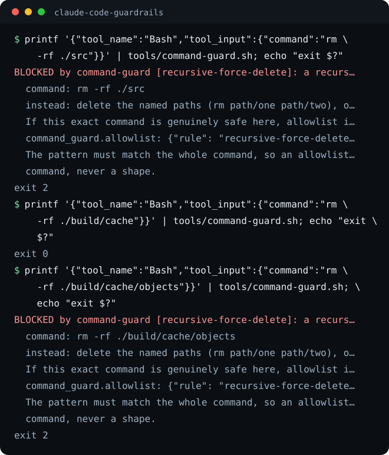

# claude-code-guardrails

Four guards for Claude Code that refuse a dangerous command, a protected write, a colliding session, or an unparseable script, and say what to do instead. No model in the loop.

Bash and Python 3.9+, nothing else.

[](https://github.com/eliferres/claude-code-guardrails/actions/workflows/ci.yml)




## Install

Install the command (from GitHub; it is not on PyPI):

```bash
pipx install git+https://github.com/eliferres/claude-code-guardrails
```

Or work from a clone:

```bash
git clone https://github.com/eliferres/claude-code-guardrails.git
cd claude-code-guardrails
tools/liveness.sh          # every installed guard, proved to still block
bash tests/run-tests.sh    # the full suite, hermetic, no network
```

Installed, each script in `tools/` is a subcommand of one command:
`claude-code-guardrails command-guard` does what `tools/command-guard.sh` does
(the others are `file-lock`, `lock-approve`, `claims-guard`, `claims-clear`,
`claims-takeover`, `syntax-guard`, `secret-scan` and `liveness`). It reads `guardrails.json` from
`$GUARDRAILS_PROJECT_DIR`, then `$CLAUDE_PROJECT_DIR`, then the current
directory. `liveness` also needs the kit's `tools/` and `tests/`, so run it
inside a clone. An editable install (`pip install -e`) is the exception: the
module still sits in the checkout, so it reads that checkout's `guardrails.json`
and runs liveness against that kit, wherever you call it from.

To put the kit in a project without installing anything, copy `tools/`,
`guardrails.json` and `demo/.claude/settings.json` into your project root, then
edit `guardrails.json`: the rules, the protected paths and the allowlist are all
yours. Add `.guardrails/` to your project's `.gitignore`: the guards keep their
state and decision log there, and this kit's own ignore file does not travel
with the copy. The walkthrough below runs every guard against the fictional
workspace in `demo/`, no install needed.

## The guards

**Command guard.** A PreToolUse hook on Bash. It matches the command against a
list of shapes you configure (recursive force-delete, blanket `git add -A`,
world-writable or recursive `chmod`, force-push to a protected branch,
curl-piped-into-a-shell, `git reset --hard`, `git clean -f`) and refuses with
the shape it caught and the safe way to do the same job. One exact command can
be allowlisted; a shape cannot.

Each rule is matched twice: against the command as written, and against the
same command parsed the way the shell would and written back in one spelling.
That reading removes quotes and backslashes (`'rm'`, `r\m`, `$'-rf'`), splits
on an unquoted `$IFS`, expands a glob (`/bin/r[m]`) or a brace list or range
(`{rm,-rf,x}`, `{r..r}m`) in the command word, drops the directory (`/bin/rm`),
wrappers (`env`, `command`, `sudo`, `nohup`) and leading `VAR=value` words,
reads past a reserved word (`{`, `if`, `do`, `!`) to the command after it,
lowercases the name (macOS finds `RM` as `rm` on its default case-insensitive
disk), and expands an alias defined earlier in the same command. Two commands
also get their arguments rewritten, after brace expansion (`-{r,f}` is `-r -f`):
`rm` has its flags gathered into one cluster (`-r --force`, `-rv -f`,
`--recursive -f` and the shortened `--rec -f` all read as `-fr`), and `git`
loses its global options (`-c k=v`, `-C dir`), with every way of forcing a push
(`-f`, `-fu`, a `+main` refspec) read as `--force`. The text handed to `sh -c`,
`bash -lc` or `eval` is read the same way, three levels deep. A command that
reading cannot parse (an unclosed quote, a brace list of more than 1024 words)
is refused when its raw text names a command any rule covers, or holds an
unquoted brace expression that could hide one (`{r,}m`).

A rule with `"allow_in_temp": true` (the shipped recursive-delete rule has it)
lets a recursive `rm` through when the command is nothing but `rm` and `cd`
into temp, and every path resolves strictly inside the system temp folders
(`$TMPDIR`, `/tmp`, `/var/tmp`). Scratch work there is routine and safe to lose.
Paths are resolved before the command runs, so any other command in the line
(an `ln -s` or `mv` could repoint a temp path first), a bracket, a backtick or a
heredoc keeps the refusal, as do `/tmp` itself, a `..` that climbs out, a
symlink that leads out, a variable the guard cannot read, or a folder it lost
track of after a brace group, branch, `eval` or `source`.

| Rule | Refuses | Why |
| --- | --- | --- |
| `recursive-force-delete` | `rm -rf` and its flag spellings, outside the temp folders | removes a tree with no confirmation and no undo |
| `blanket-git-stage` | `git add -A`, `git add .` | sweeps up secrets, local state files and unrelated edits |
| `wide-chmod` | `chmod -R`, `777`, `666`, `a+w`, `o+w` | quietly opens up every file under a tree |
| `force-push-protected` | `git push --force` naming `main` or `master` | rewrites history other people have already pulled |
| `curl-pipe-to-shell` | `curl` or `wget` piped into a shell | executes code nobody read |
| `git-reset-hard` | `git reset --hard` | throws away uncommitted work with no recovery path |
| `git-clean-force` | `git clean -f` | deletes untracked files git never had a copy of |
| `shell-write-protected` | a redirect, `tee`, `sed -i`, `cp` or `mv` into a file the lock protects | the lock sees the Write and Edit tools; a shell write would go around it |

**Protected-file lock.** A PreToolUse hook on writes. Files you list as
high-stakes (settings, hook scripts, the rules the agent reads every session)
are refused unless an approval token names them. The token covers one batch,
expires, and is minted by a separate command a human runs after seeing the
change. A live token from other work is not a yes for this one. On macOS,
whose disks ignore case by default, protected names match without case, so
`GUARDRAILS.JSON` is still `guardrails.json`.

The lock only sees the file tools, so the command guard narrows the shell
route to the same paths; it does not close it. It reads the command the way the
shell would (quotes, redirects without spaces, brace lists and ranges, heredocs,
a `cd`, `pushd` or `popd` earlier in the line) and refuses a write into a
protected file whatever token is open, pointing back to the file tools. In or
after a branch, a loop, a brace group, or at a `cd` after `||` or at the end of
a pipeline, where a `cd` may or may not have run or moved the shell, it checks a
relative write in every folder the command may be in; a `cd` piped into another
command runs in a subshell and moves nothing. After a move
it cannot read (`cd -`, a `cd` into a variable, `CDPATH`, `pushd +N`, `eval`,
`source`, a `cd`, `pushd` or `popd` anywhere in a loop, from its `for`, `while`,
`until` or `select` to the end of its body, or one inside a function
definition, which leaves the folder unknown for the rest of the command) it
refuses a relative write whose file name matches the last part of a protected
pattern, a bare `*` (`tools/*`) matching any name. It reads the writes
a redirect, `tee`, `sed -i`, `cp` and `mv` make, and these pass: any other
program that writes (`dd`, `install`, `rsync`, `perl -i`, a script), a path
built from a command substitution or from a variable other than `$HOME` and
`$TMPDIR` (or one of those the command sets itself), a `~user` path, and a
write after a `cd` into an unquoted substitution (`cd $(git rev-parse
--show-toplevel)/tools`).

This refuses ordinary commands too: after
`cd "$PROJECT_DIR" && npm run build > build.log` the guard cannot see the
folder, and `tools/*` matches `build.log` by name.

**Cross-session write claims.** Two agent sessions on one file means the second
write silently eats the first. The first writer claims the file; a second
session is refused, told who holds it and for how long, and given two ways out:
release the claim, or take it over. A takeover is logged, and what the displaced
session was holding is written to a ledger so it gets picked up rather than lost.

**Syntax guard.** A PreToolUse hook on writes. A shell or Python file under the
paths in `syntax_check.paths` is rebuilt as the Write or Edit would leave it and
parsed before it lands: `bash -n` for shell (`zsh -n` for a zsh shebang, when
zsh is installed), a compile for Python, and a compile of the Python a shell
file embeds in a `python3 -c '...'` body (any `python3.X` name) or a quoted
heredoc. That last check exists because of one shape: an apostrophe in a comment
inside a single-quoted `-c` body ends the shell string early. With an even quote
count `bash -n` still passes and the Python runs cut off; it broke three hooks in
one day. Checking before the write matters for hooks in particular, since a hook
that does not parse refuses every call that runs it, including the fix.

## Liveness: proving a guard still blocks

A liveness harness proves the four still block, months later.
Guards rot quietly: a refactor loosens a pattern, a test starts passing for the
wrong reason, and the wall has been open for a month. The manifest lists every
installed guard, every guard needs at least one red case proving it still
blocks, and the harness fails if an entry has no red case, if a red case stops
blocking, or if a red case still passes with the guard stubbed out. That last
check is the point: a test that passes without the guard was never testing the
guard.

## The decision log: retiring a noisy rule

Liveness proves a rule still fires; the decision log tells you whether it
should. Every refusal is appended to `.guardrails/decisions.jsonl` with its
guard, rule id and the command or path, and one allowed call in
`decision_log.sample_allow_every` (default 10, `0` turns it off) is logged too,
so each guard's traffic can be estimated without logging all of it:

```bash
python3 - <<'PY'
import collections, json
every = 10  # decision_log.sample_allow_every
rows = [json.loads(line) for line in open(".guardrails/decisions.jsonl")]
calls = collections.Counter(r["guard"] for r in rows if r["decision"] == "allow")
denies = collections.Counter((r["guard"], r["rule"]) for r in rows if r["decision"] == "deny")
for (guard, rule), count in denies.most_common():
    seen = calls[guard] * every + sum(n for (g, _), n in denies.items() if g == guard)
    print("%-14s %-26s %5d refusals, %.1f%% of its calls" % (guard, rule, count, 100.0 * count / seen))
PY
grep '"rule": "wide-chmod"' .guardrails/decisions.jsonl   # then read what one rule refused
```

A rule that fires often and whose refusals are all safe commands is costing more
than it protects: narrow its pattern, allowlist the exact commands, or delete
it. In the setup these guards came from, two rules were retired that way after
259 and 466 refusals in six days, none of them a real catch. The log holds the
commands as typed, so it is created readable by its owner only (mode 600) and
belongs in a git-ignored `.guardrails/` folder (see the install note). A row that cannot be written
costs one warning line on stderr and never changes the verdict.

## Wiring it into Claude Code

This is the whole install, copied from `demo/.claude/settings.json` (that file
is the source of truth):

```json
{
  "hooks": {
    "PreToolUse": [
      {
        "matcher": "Bash",
        "hooks": [
          { "type": "command", "command": "\"$CLAUDE_PROJECT_DIR\"/tools/command-guard.sh", "timeout": 10 }
        ]
      },
      {
        "matcher": "Write|Edit|MultiEdit|NotebookEdit",
        "hooks": [
          { "type": "command", "command": "\"$CLAUDE_PROJECT_DIR\"/tools/file-lock-guard.sh", "timeout": 10 },
          { "type": "command", "command": "\"$CLAUDE_PROJECT_DIR\"/tools/claims-guard.sh", "timeout": 10 },
          { "type": "command", "command": "\"$CLAUDE_PROJECT_DIR\"/tools/syntax-guard.sh", "timeout": 10 }
        ]
      }
    ],
    "SessionEnd": [
      {
        "hooks": [
          { "type": "command", "command": "\"$CLAUDE_PROJECT_DIR\"/tools/claims-clear.sh", "timeout": 10 }
        ]
      }
    ]
  }
}
```

Guards deny by exiting 2 with the reason on stderr: the PreToolUse contract
that cancels the tool call and hands the text back to the agent. Everything they
do not block exits 0 and is never seen again. The command-line jobs exit 2 on a
usage or configuration error, with one line on stderr naming what failed.

## Secret scan before a push

An optional git pre-push hook, separate from the agent guards: it reads every
line each pushed commit adds and refuses the push when one looks like a
credential, naming the file, the shape and the commit, never the value. Each
commit is read on its own, so a key added and then deleted before the push is
still caught; it would still be in the published history. Install it per
repository from a clone of this kit, or point it at the installed command:

```bash
ln -s /path/to/claude-code-guardrails/tools/pre-push-secret-scan.sh .git/hooks/pre-push
# or, installed:
printf '#!/bin/sh\nexec claude-code-guardrails secret-scan "$@"\n' > .git/hooks/pre-push && chmod +x .git/hooks/pre-push
```

The shapes follow the public gitleaks rules, kept to ones with a fixed vendor
prefix or frame so a hit is almost never wrong: `aws-access-key`, `github-token`,
`gitlab-token`, `slack-token`, `stripe-key`, `anthropic-key`, `openai-key`,
`google-api-key`, `npm-token`, `private-key`, `slack-webhook`, `sendgrid-key`,
`huggingface-token`, `pypi-token` and `stripe-webhook-secret`. One looser shape,
`generic-secret`, catches a name like `api_key` or `password` assigned a literal
of 16 or more characters mixing letters and digits (an unquoted call or dotted
name, such as `b64encode(raw)`, is code, not a literal); it is the one most
likely to fire on a test fixture. Paths listed in `.secret-scan-allow` at the top of the
repository (one glob per line, `#` for comments) are skipped, which is where
fake keys in fixtures belong. There is no override flag: a real key gets taken
out of the commits, not waved through.

## Walkthrough

Every command below runs from a fresh clone, against the demo workspace.

```bash
export GUARDRAILS_PROJECT_DIR="$PWD/demo"
```

**Try a blocked command.**

```bash
printf '{"tool_name":"Bash","tool_input":{"command":"rm -rf ./src"}}' | tools/command-guard.sh; echo "exit $?"
```

```
BLOCKED by command-guard [recursive-force-delete]: a recursive force-delete (rm -rf), which removes a tree with no confirmation and no undo
  command: rm -rf ./src
  instead: delete the named paths (rm path/one path/two), or move them to a trash directory you can inspect
  If this exact command is genuinely safe here, allowlist it in .../demo/guardrails.json under
  command_guard.allowlist: {"rule": "recursive-force-delete", "command": "^...$", "why": "..."}.
  The pattern must match the whole command, so an allowlist entry frees one
  command, never a shape.
exit 2
```

The config path in a real refusal is absolute; it is shortened here.

The demo config allowlists exactly one command (the generated build cache),
and the neighbour path is still refused, because an allowlist entry is a whole
anchored command, not a pattern:

```bash
printf '{"tool_name":"Bash","tool_input":{"command":"rm -rf ./build/cache"}}' | tools/command-guard.sh; echo "exit $?"
printf '{"tool_name":"Bash","tool_input":{"command":"rm -rf ./build/cache/objects"}}' | tools/command-guard.sh; echo "exit $?"
```

**Write to a protected file, get refused, mint a token, succeed.**

```bash
printf '{"tool_name":"Write","tool_input":{"file_path":"%s/rules/team-rules.md"}}' "$GUARDRAILS_PROJECT_DIR" \
  | tools/file-lock-guard.sh
echo "exit $?"   # 2 — no token, and the refusal prints the exact mint command

tools/lock-approve.sh "tighten the review rule" "$GUARDRAILS_PROJECT_DIR/rules/team-rules.md"

printf '{"tool_name":"Write","tool_input":{"file_path":"%s/rules/team-rules.md"}}' "$GUARDRAILS_PROJECT_DIR" \
  | tools/file-lock-guard.sh
echo "exit $?"   # 0 — the token names this file

printf '{"tool_name":"Write","tool_input":{"file_path":"%s/guardrails.json"}}' "$GUARDRAILS_PROJECT_DIR" \
  | tools/file-lock-guard.sh
echo "exit $?"   # 2 — the same live token does not cover a file outside its batch
```

**Collide two sessions on one file.**

```bash
printf '{"tool_name":"Write","tool_input":{"file_path":"%s/notes/scratch.md"},"session_id":"session-alpha"}' \
  "$GUARDRAILS_PROJECT_DIR" | tools/claims-guard.sh
echo "exit $?"   # 0 — alpha now holds the claim

printf '{"tool_name":"Write","tool_input":{"file_path":"%s/notes/scratch.md"},"session_id":"session-beta"}' \
  "$GUARDRAILS_PROJECT_DIR" | tools/claims-guard.sh
echo "exit $?"   # 2 — names session-alpha, its age, and both ways out

tools/claims-takeover.sh "$GUARDRAILS_PROJECT_DIR/notes/scratch.md" "the release note is blocked on this file"
cat demo/.guardrails/takeover-ledger.jsonl
```

**Watch liveness go red.** It passes on a healthy kit, then loses a red case:

```bash
tools/liveness.sh

python3 - <<'PY'
import json
config = json.load(open("guardrails.json"))
config["guards"][0]["red_tests"] = []          # the command guard loses its proof
json.dump(config, open("guardrails.json", "w"), indent=2)
PY

tools/liveness.sh
echo "exit $?"   # 1 — "no red test — a guard nobody proves can still block is a guard nobody can trust"
git checkout guardrails.json
```

Clean up the demo state when you are done: `rm -r demo/.guardrails`.

## Why deterministic guards

Prompt rules degrade: they compete for attention with everything else in the
context, and the failure is silent. You find out from the diff. A hook is
different in kind. It runs on every call, it has no memory of what it was asked
to overlook, and when it fires you get a refusal you can read. The tradeoff is
that a deny-list is never complete, which is exactly why the liveness harness
matters more than the rules: the value is not that these particular eight shapes
are blocked, it is that you can still prove, months later, that they are.

## What the guards enforce

1. **A dangerous shape is refused, not discouraged.** The check runs before the
   tool call, in code, whatever the model decided.
2. **Every refusal carries the fix.** The blocked shape, the exact command, the
   safe alternative, and how to allowlist it if it is genuinely fine here. A
   refusal an agent cannot act on just produces a workaround.
3. **Approval is scoped and expires.** A token names its files and its batch, so
   yesterday's yes cannot authorise today's edit.
4. **A losing session is deferred, never dropped.** Takeovers are logged with
   what the displaced session was holding.
5. **Every gate can still go red.** Proved on every CI run, including against a
   stubbed-out guard, so a test cannot pass for the wrong reason.

## Limitations

- The guards live in the harness's hook layer. A session run without hooks, a
  different tool that writes files, or a shell outside the agent bypasses them
  entirely. This is a seatbelt, not a sandbox.
- Shape lists are deny-lists and cannot be complete. `rm -rf` is caught,
  `find . -delete` is not until you add it. Treat the shipped rules as a
  starting set you extend from your own incidents.
- Single machine, single project. Claims are files in `.guardrails/`, so two
  sessions only see each other if they share a filesystem.
- Guards fail open on a config that is missing, unreadable or malformed,
  deliberately: a config typo must not brick the harness. Each one prints one
  warning on stderr naming the config and what was wrong with it, and liveness
  is what tells you a guard went quiet. Any other failure inside a guard
  refuses the call, since Claude Code reads every exit but 2 as allow.
- The command guard reads the command, not what it runs. A command held in a
  variable (`$CMD -rf x`) or built by a substitution, an alias from your shell
  profile, a git alias (`git -c alias.p=push p -f`), a script file that wraps
  the dangerous call, and a nested `sh -c` more than three levels deep will walk
  past it. So will script text fed to a shell on its input (`bash <<< '...'`,
  `echo '...' | bash`, a `bash <<EOF` heredoc), the string `env -S` splits into
  a command, a `coproc`, the body of a function defined with `function f { ...; }`,
  and a command run by `timeout`, `xargs` or `find -exec`. Arguments are parsed
  for `rm` and `git` only; every other rule matches its pattern against the text
  and the normalized command.
- A `cd` after `&&` is followed as if it ran, so when a command before it fails
  (`false && cd sub; echo x > guardrails.json`), a later write lands in the
  folder before the `cd` while the guard checks the folder after it.
- Exercised with Claude Code. Any harness that can run a hook script and read an
  exit code can use these, but the payload shape is Claude Code's.

## Files

- `tools/command-guard.sh`: PreToolUse on Bash, refuses configured command shapes.
- `tools/file-lock-guard.sh`: PreToolUse on writes, protected paths need a token.
- `tools/syntax-guard.sh`: PreToolUse on writes, a script that would not parse is refused.
- `tools/lock-approve.sh`: mints the batch-scoped, expiring approval token.
- `tools/claims-guard.sh`: PreToolUse on writes, refuses a file another session holds.
- `tools/claims-clear.sh`: releases claims; wire it to SessionEnd.
- `tools/claims-takeover.sh`: takes a claim and ledgers what it displaced.
- `tools/liveness.sh`: proves every guard in the manifest still goes red.
- `tools/pre-push-secret-scan.sh`: optional git pre-push hook, refuses a push that adds a credential.
- `tools/claude_code_guardrails/`: the implementation every shim calls, one module per job plus the shell reader. Stdlib only.
- `guardrails.json`: one config, holding the rules, allowlist, protected paths, claims and manifest.
- `demo/`: a fictional workspace and the hook wiring, for the walkthrough.
- `tests/run-tests.sh`: the suite, real fixtures in temp dirs, no mocks.
- `tests/red/`: one red case per blocked shape; liveness runs these.
- `tests/demo-transcript.sh`: replays `demo/transcript.json` and checks the image against it.

State lives in `.guardrails/` inside the project: the approval token, the claims
registry, the takeover ledger, the approval log and the decision log. Keep it
out of git (this repository ignores it; a project you copy the kit into needs
its own `.gitignore` line): these are local facts about one machine's sessions.
